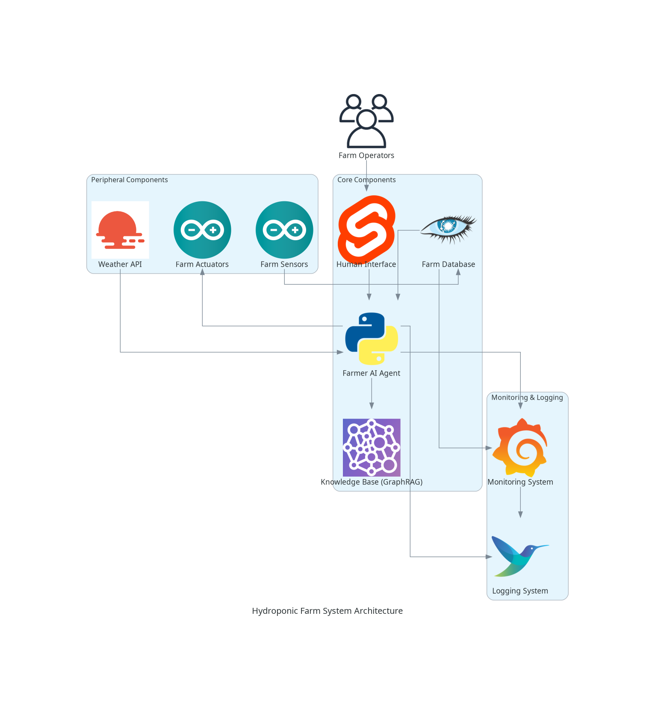

# 工作流

## 節點

- Farmer AI agent (llm)
- Human Interface
- Farm Database
- Farm sensor (e.g. temperature sensor, humidity sensor, hp sensor)
- Farm actuator (e.g. water pump, light)
- Weather API
- Knowledge Base (using GraphRAG - by microsoft)

## 框架

| 節點 | 框架 | 資料格式 |
| --- | --- | --- |
| Farmer AI agent | Python, langchain | JSON |
| Human Interface | Svelte | JSON |
| Farm Database | Cassandra | JSON |
| Farm sensor | Arduino | JSON |
| Farm actuator | Arduino | JSON |
| Weather API | OpenWeatherMap | JSON |
| Knowledge Base | GraphRAG | JSON |

## 流程

### 環境事件

#### 事件1：水溫異常

- **觸發條件**：水溫感測器讀數超出安全範圍。
- **流程**：
  1. 水溫感測器將數據發送至農場數據庫。
  2. Farmer AI agent 定期檢查水溫數據。
  3. 如果水溫異常，Farmer AI agent 指令相關的執行器（如水冷系統）調整水溫。
  4. 系統調整後，更新知識庫以記錄解決方案及效果。

#### 事件2：水質不平衡

- **觸發條件**：水質感測器偵測到pH值或營養鹽濃度異常。
- **流程**：
  1. 水質感測器將數據發送至農場數據庫。
  2. Farmer AI agent 分析水質數據。
  3. 根據需要，Farmer AI agent 指令添加適當的調節化學品或營養液。
  4. 水質調整後，更新知識庫記錄事件和解決方案。

#### 事件3：溶解氧過低

- **觸發條件**：溶氧感測器讀數低於安全範圍。
- **流程**：
  1. 溶氧感測器將數據發送至農場數據庫。
  2. Farmer AI agent 分析溶氧數據。
  3. 如果溶氧過低，Farmer AI agent 指令增氧設備提高水中氧氣含量。
  4. 增氧後，記錄調整結果和效果於知識庫。

### 人為啟用事件

#### 事件1：手動添加營養液

- **觸發條件**：操作員通過人機介面手動添加營養液。
- **流程**：
  1. 操作員在人機介面選擇添加營養液選項並執行。
  2. 人機介面向Farmer AI agent 發送添加營養液請求。
  3. Farmer AI agent 指令相應的執行器添加營養液。
  4. 添加完成後，操作和結果記錄到農場數據庫和知識庫。

#### 事件2：調整水流速度

- **觸發條件**：操作員透過人機介面調整水流速度。
- **流程**：
  1. 操作員在人機介面上調整水流速度設定。
  2. 設定更新後，人機介面將更改傳送給Farmer AI agent。
  3. Farmer AI agent 調整水泵速度，更新水流。
  4. 變更完成後，操作記錄於農場數據庫及知識庫。

## 架構圖

